# HR Attrition Analytics — Power BI, SQL & Python

End‑to‑end BI case study on employee attrition: a star‑schema model in Power BI, 31 DAX measures,
a what‑if simulator, an interactive web dashboard, and a costed recommendation plan.

<p>


</p>

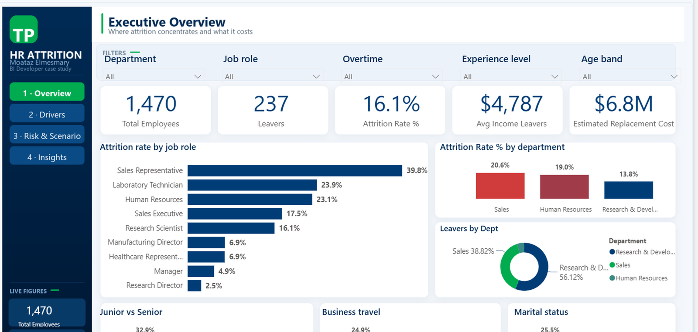

---

## The finding in one paragraph

The company loses **237 of 1,470 employees a year — 16.1%**. That average hides an eight‑fold
spread. **Overtime is the strongest driver in the data**: people working overtime leave at 30.5%
against 10.4% for everyone else, and although they are only 28% of the workforce they account for
**54% of everyone who left**. Risk compounds rather than adds — overtime plus a salary under
$2,500 loses **68.6%** of that group, meaning those employees are more likely to leave than to
stay. Three frontline roles produce 60% of all leavers, 65% of leavers held no stock options, and
a third leave inside their first year. Overtime governance alone is worth roughly **84 prevented
exits a year**, about $2.4M in replacement cost.

| | | |
|---|---|---|
| **1,470** employees | **237** leavers | **16.1%** attrition |
| **2.9×** overtime risk | **68.6%** worst segment | **$6.8M** replacement cost |

---

## Contents

- [Power BI report](#power-bi-report) · 4 pages, 88 visuals, live what‑if simulator
- [Web dashboard](#web-dashboard) · single self‑contained HTML file, no dependencies
- [Presentation](#presentation) · 5‑minute stakeholder deck
- [SQL](#sql) · star‑schema joins and aggregation
- [Python](#python) · classification and the full exploratory analysis
- [Excel exercise](#excel-exercise) · separate reporting test
- [How it is built](#how-it-is-built)
- [Reproducing it](#reproducing-it)

---

## Power BI report

Built as a `.pbip` project — the model is TMDL, the report is PBIR, so everything is readable
text and diff‑able in git. The chrome (navigation rail, card frames, page headers) is a designed
background image with transparent visuals layered on top, which keeps the visual count low.

### 1 · Executive Overview
Where attrition concentrates, and what it costs. The department chart makes the point that rate
and count disagree: R&D has the **lowest rate** (13.8%) and the **largest share** of leavers
(56%), because it holds 961 of the 1,470 people.


### 2 · Why They Leave
Drivers ranked by statistical strength. Overtime, pay gradient, equity, and a role × overtime
heat matrix that exposes the compound effect.

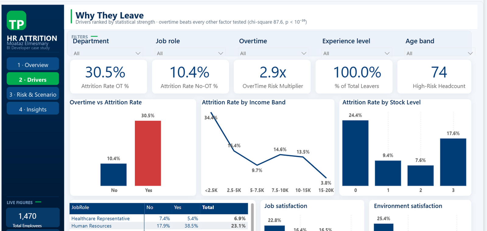

### 3 · Risk Segments & What‑If Scenario
A live simulator: move the slider and the model shifts the overtime population proportionally
onto the no‑overtime attrition rate, recalculating prevented exits and saved cost in DAX.

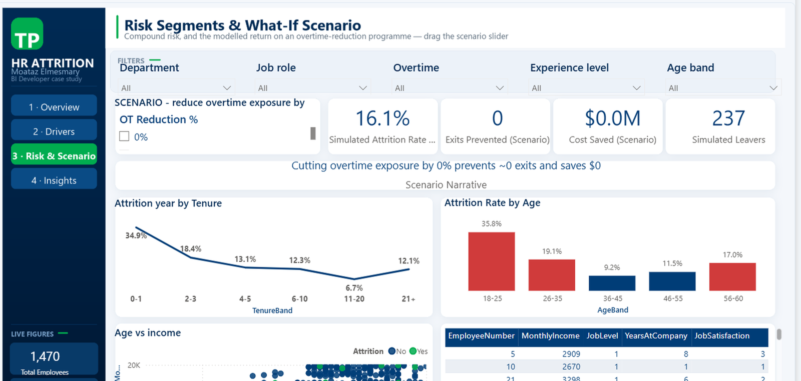

### 4 · Insights & Recommended Plan
The written conclusions and the sequenced roadmap, kept inside the report so the file presents
on its own.

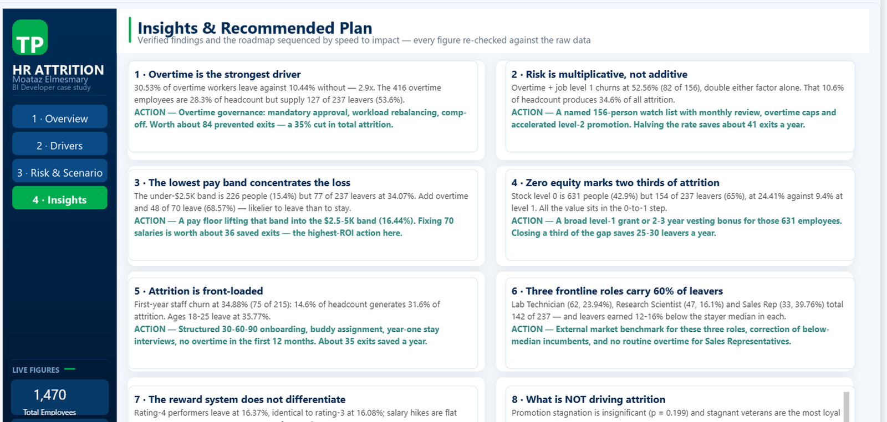

**Bar colour is driven by a measure, not set per series:**

```dax
Bar Colour =
VAR _seg     = [Attrition Rate %]
VAR _company = [Attrition Rate (Company) %]   -- REMOVEFILTERS keeps this at 16.1%
RETURN
    IF ( _seg > _company, "#D03B3B", "#003D77" )
```

Bound through *Format ▸ fx ▸ Field value*, so every bar recolours under any filter and the rule
lives in one place.

---

## Web dashboard

`HR_Attrition_Dashboard.html` — one file, no CDN, no build step. Charts are hand‑built SVG,
animated on scroll; every metric carries a tooltip with its definition and the DAX behind it.

| Overview | Drivers |
|---|---|
| 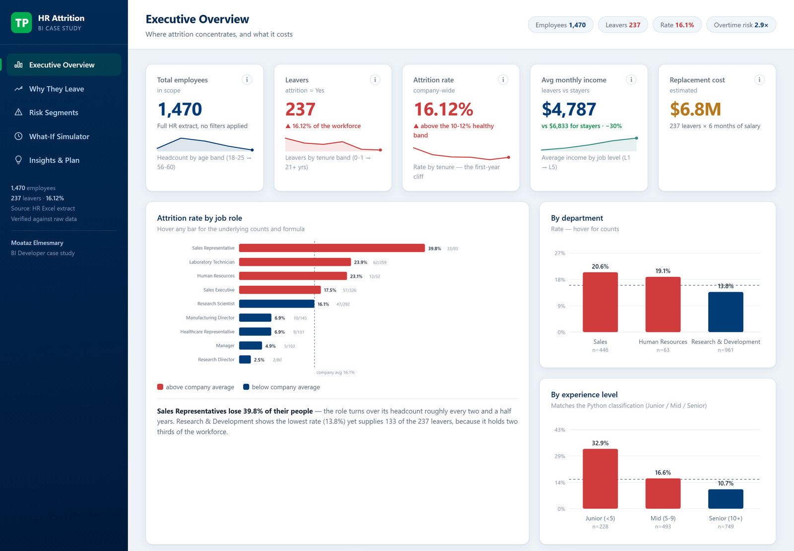 | 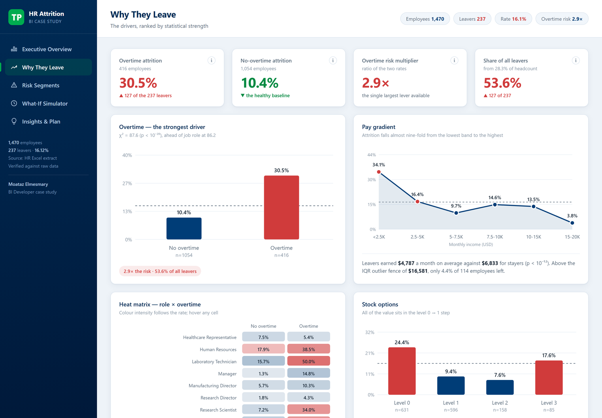 |

### The what‑if simulator

Drag the slider and the page recomputes live — same arithmetic as the DAX measure, shown on the
page so the reader can check it.

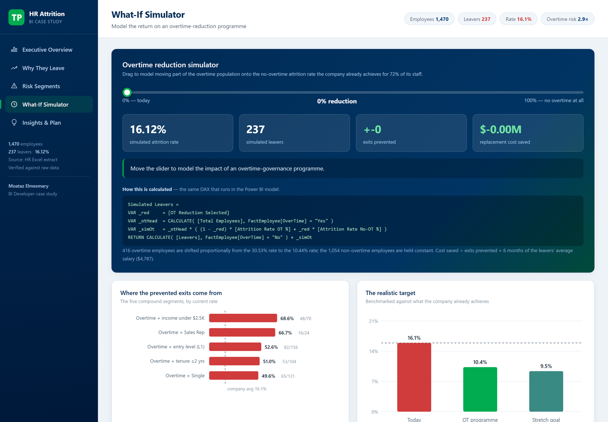

| Risk segments | Insights & plan |
|---|---|
| 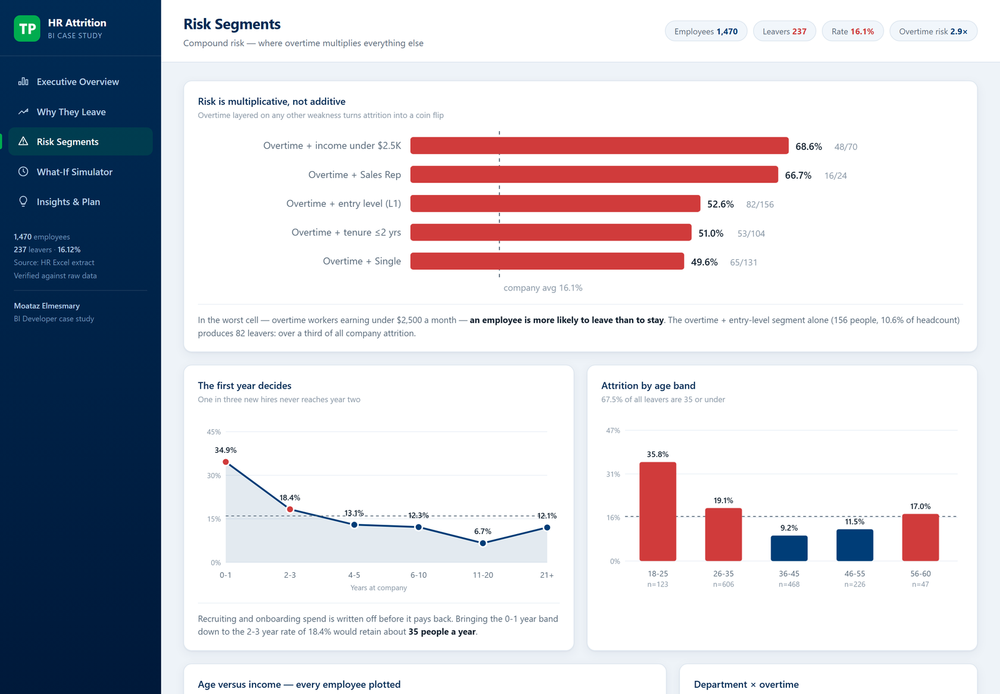 | 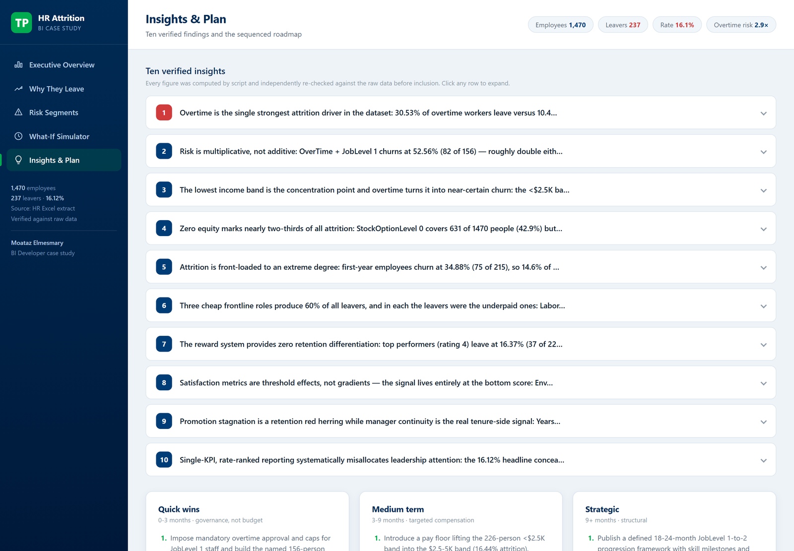 |

---

## Presentation

Nine slides, five minutes, speaker notes on every slide. Each driver slide puts the evidence on
top and the recommendation — with its expected annual saving — directly underneath it.

| Where it happens | The strongest driver |
|---|---|
| 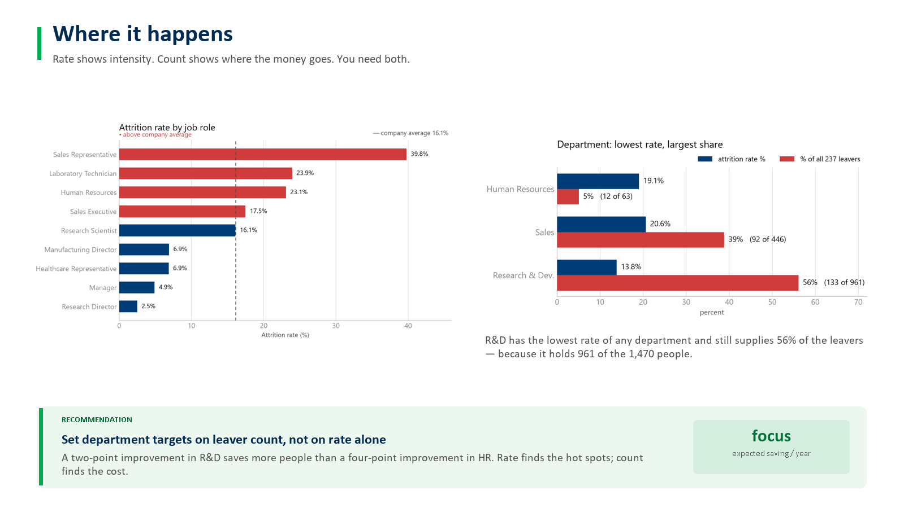 | 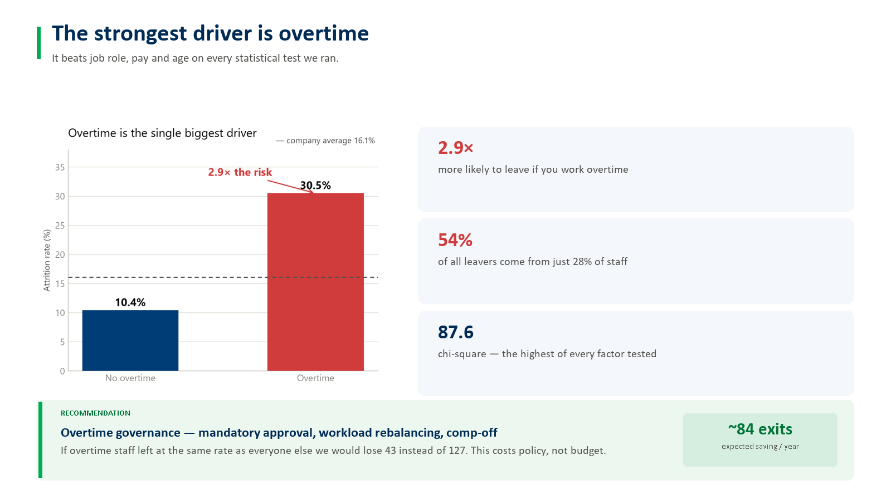 |

| Compound risk | The sequenced plan |
|---|---|
| 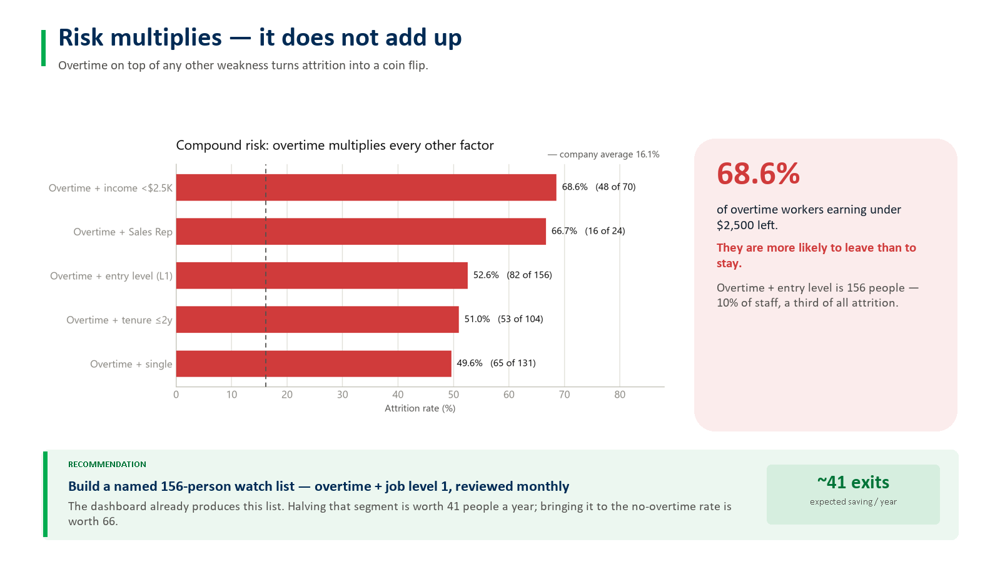 | 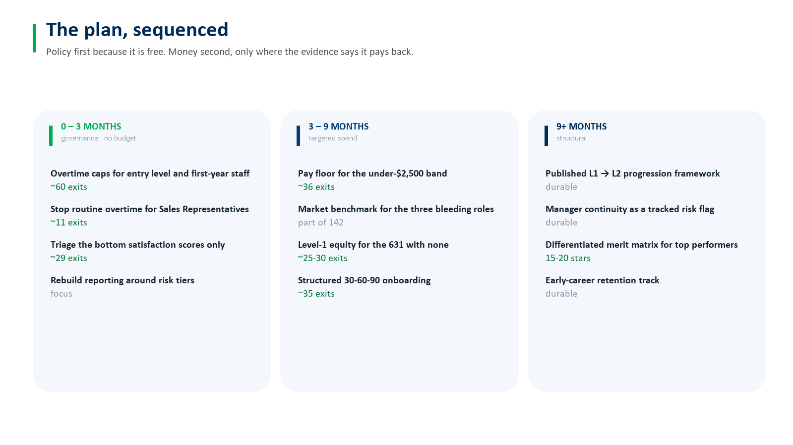 |

---

## SQL

Joins the employee fact table to the Department and Job Role dimensions, aggregates attrition
count and average income, sorted by attrition count.

```sql
SELECT
      d.Department
    , j.JobRole
    , SUM(CASE WHEN f.Attrition = 'Yes' THEN 1 ELSE 0 END) AS AttritionCount
    , ROUND(AVG(f.MonthlyIncome), 2)                       AS AvgMonthlyIncome
FROM FactEmployee AS f
JOIN DimDepartment AS d ON d.DepartmentKey = f.DepartmentKey
JOIN DimJobRole    AS j ON j.JobRoleKey    = f.JobRoleKey
GROUP BY d.Department, j.JobRole
ORDER BY AttritionCount DESC;
```

| Department | Job role | Attrition count | Avg monthly income |
|---|---|---:|---:|
| Research & Development | Laboratory Technician | 62 | 3,237.17 |
| Sales | Sales Executive | 57 | 6,924.28 |
| Research & Development | Research Scientist | 47 | 3,239.97 |
| Sales | Sales Representative | 33 | 2,626.00 |
| Human Resources | Human Resources | 12 | 4,235.75 |

Three further queries cover attrition rate with headcount context, the overtime split per
department using a window function, and the pay gap between leavers and stayers per role.
→ [`sql/attrition_analysis.sql`](2_HR_Attrition_Case_Study/sql/attrition_analysis.sql)

---

## Python

```python
df["ExperienceLevel"] = pd.cut(
    df["TotalWorkingYears"],
    bins=[-1, 4, 9, df["TotalWorkingYears"].max()],
    labels=["Junior (<5)", "Mid (5-9)", "Senior (10+)"],
)

summary = (df.groupby("ExperienceLevel", observed=True)
             .size()
             .reset_index(name="EmployeeCount"))
```

```
ExperienceLevel  EmployeeCount
    Junior (<5)            228
      Mid (5-9)            493
   Senior (10+)            749
```

Juniors leave at 32.9% against 10.7% for seniors — three times the rate.

`python/full_eda.py` reproduces every figure quoted anywhere in this repository: rates by every
dimension, the compound segments, leaver‑versus‑stayer comparisons, and IQR outlier fences.

---

## Excel exercise

A separate reporting test on 25,000 contact‑centre interactions: date parsing, lookups,
dependent dropdowns, a PivotTable, and a broken month‑to‑date report to diagnose and repair.

The timestamps arrive as **text** in `dd/mm/yyyy hh:mm:ss`. `DATEVALUE` would flip day and month
depending on the machine's regional settings, so the date is rebuilt from its parts instead:

```excel
=DATE( MID(A2,7,4)+0, MID(A2,4,2)+0, LEFT(A2,2)+0 )     ' date, locale‑safe
=TIMEVALUE( MID(A2,12,8) )                              ' time
=TIMEVALUE( MID(A2,12,2) & ":00:00" )                   ' hourly interval
```

Dependent dropdown — one named range per manager, selected through `INDIRECT`:

```excel
' H2  Data Validation ▸ List ▸ =ManagersList
' I2  Data Validation ▸ List ▸ =INDIRECT($H$2)
=IF( $I$2="", "", COUNTIF( Data!$G$2:$G$25000, $I$2 ) )
```

**The month‑to‑date report had three faults.** The `SUMIF` carried no date condition at all, so it
was adding January, February and March together — the total was overstated 47‑fold. `English` was
misspelled `Englishh`, so the largest language matched nothing, returned "N/A" and dropped out of
the total entirely. And the header read *Total Tal time*.

```excel
' before
=IF( SUMIF(Data!$D:$D, B6, Data!J:J)=0, "N/A", SUMIF(Data!$D:$D, B6, Data!J:J) )

' after — filtered on language AND on the current month, anchored dynamically
F5: =EOMONTH( MAX(Data!$O$2:$O$25000), -1 ) + 1
C6: =IF( SUMIFS(Data!$J$2:$J$25000, Data!$D$2:$D$25000, $B6,
                Data!$O$2:$O$25000, ">="&$F$5) = 0, "N/A",
         SUMIFS(Data!$J$2:$J$25000, Data!$D$2:$D$25000, $B6,
                Data!$O$2:$O$25000, ">="&$F$5) )
```

Corrected month‑to‑date total: **315,217** against the 14,928,117 the broken version reported.
Anchoring on `EOMONTH(MAX(date),-1)+1` means it stays month‑to‑date as new data lands rather than
needing a hard‑coded date.

---

## How it is built

```
                DimDepartment (3)        DimJobRole (9)
                        \                     /
   DimTravel (3) ---- FactEmployee (1,470) ---- DimEducation (30)
                             |
                     DimDemographics (30)

   OT Reduction Scenario (21)   — disconnected, read with SELECTEDVALUE
```

**Pipeline.** One parameterised source path → one cleaned staging query (`Employees_Raw`, not
loaded) → five dimensions built by *Reference* → *Remove Duplicates* → *Index* → a fact table that
merges the surrogate keys back on. Three constant columns are dropped at the source: they have a
single distinct value each and can explain nothing.

**Model.** Grain is one row per employee — the dataset is a snapshot, not a transaction log. All
relationships are one‑to‑many, single direction. Surrogate keys are hidden from report view.

**Measures.** 31, in a dedicated `_Measures` table, every multi‑step one written with
`VAR`/`RETURN`. The benchmark uses `REMOVEFILTERS` so it stays at company level while the visual
around it is sliced; IQR fences use `PERCENTILEX.INC` over `ALL` so they do not move under
filtering.

Full object‑by‑object documentation, including what each M step and each DAX function does:
→ [`PowerBI_Technical_Documentation.docx`](2_HR_Attrition_Case_Study/PowerBI_Technical_Documentation.docx)

---

## Reproducing it

```bash
pip install pandas scipy openpyxl matplotlib
cd 2_HR_Attrition_Case_Study/python
python experience_levels.py
python full_eda.py
```

Power BI: open `2_HR_Attrition_Case_Study/PowerBI_Project/HR_Attrition_Dashboard.pbip` and click
Refresh once. It reads `data/HR_Attrition_CaseStudy_Source.xlsx`; the path is a parameter, so it
can be repointed without editing a query. Needs roughly 2–3 GB of free memory.

Web dashboard: open `HR_Attrition_Dashboard.html` in any browser. No server, no internet.

---

## Repository layout

```
1_Excel_Test/                       reporting exercise, solved
2_HR_Attrition_Case_Study/
├── PowerBI_Project/                .pbip — TMDL model + PBIR report
├── PowerBI_Technical_Documentation.docx
├── HR_Attrition_Presentation.pptx
├── Narrative_and_Recommendations.docx
├── HR_Attrition_Dashboard.html
├── sql/ python/ data/ docs/ analysis_output/
assets/                             screenshots used in this README
```

---

## Notes

The dataset is the public **IBM HR Analytics Employee Attrition** sample (1,470 synthetic
employee records). No real employee data is involved.

Replacement cost assumes six months of salary per hire — the one figure in the analysis not taken
from the data. It appears in exactly two measures, so substituting a company's own multiplier
updates everything downstream.

Every number quoted in the report, the deck and this README is derived by the scripts in
`python/` and was checked against the raw file before use. Their derivations are listed in
[`docs/Figure_Sources.md`](2_HR_Attrition_Case_Study/docs/Figure_Sources.md).

**Moataz Elmesmary** — BI Developer case study
